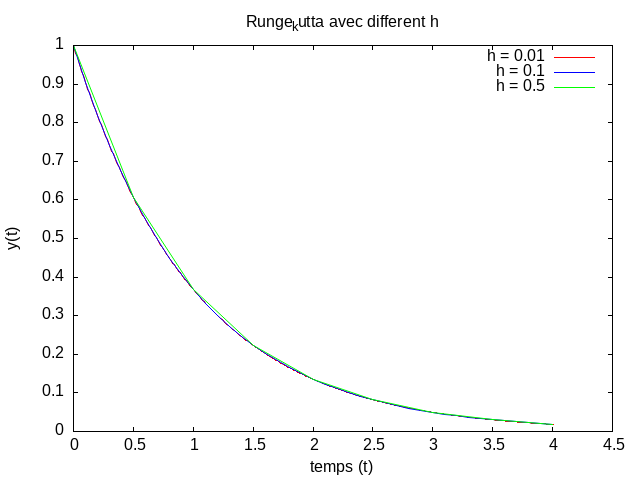
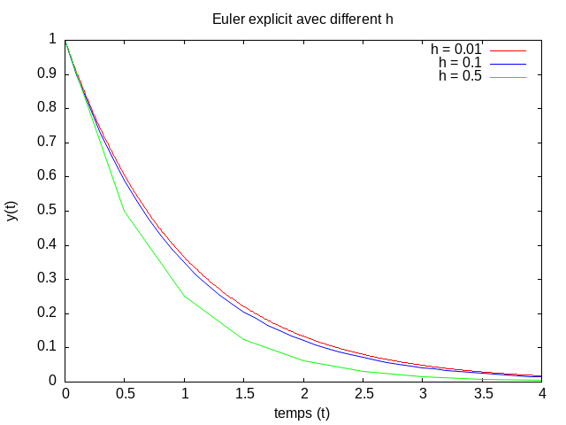

# Numerical Resolution of an ODE using Euler and Runge-Kutta Methods

## Overview
This project implements numerical methods for solving ordinary differential equations (ODEs). Specifically, three methods are used:
1. **Euler's Method** (explicit method)
2. **Runge-Kutta Method** (Fourth-order method)
3. **Runge-Kutta Method** (Second-order method)

The goal is to solve an initial value problem for a given ODE and compare the results from both methods. The results are then visualized with plots to illustrate the accuracy and convergence of each method.

## Comparison of Methods

Both methods are applied to a sample ODE, and the results are plotted for visual comparison. Euler's method tends to be less accurate for larger step sizes compared to the more accurate Runge-Kutta method.
we choose h = 0.1, h = 0.5 and h = 0.01 . We can definitly see that h = 0.01 in the Runge-kutta's methode ( fourth and second ordre) give better results than Euler's methode 

**Runge-Kutta 4th order**  |  **Euler Explicite***
:-------------------------:|:-------------------------:
  |  
