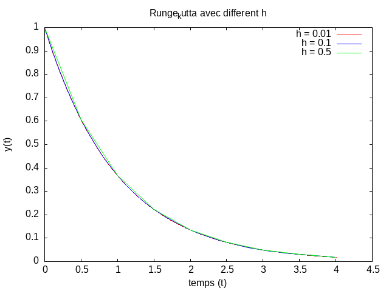
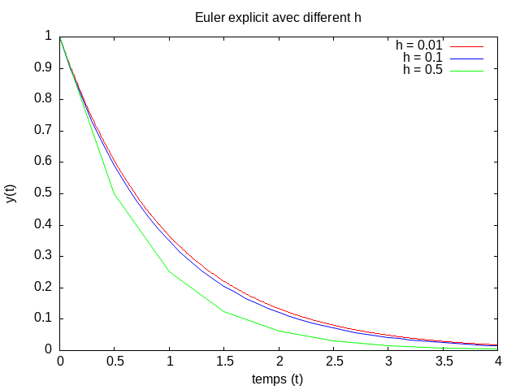

# Numerical Resolution of an ODE using Euler and Runge-Kutta Methods

## Overview
This project implements numerical methods for solving ordinary differential equations (ODEs). Specifically, three methods are used:
1. **Euler's Method** (explicit method)
2. **Runge-Kutta Method** (Fourth-order method)
3. **Runge-Kutta Method** (Second-order method)

The goal is to solve an initial value problem for a given ODE and compare the results from these methods. The results are visualized with plots to illustrate the accuracy and convergence of each approach.

# Implementation 

The implementation is written in C, and we use gnuplot for visualizing the results

# Gnuplot Script

Below is the gnuplot script used for plotting the results of the fourth-order Runge-Kutta method:

```bash
set terminal png
set output "Runge_kutta_4.png"
set datafile separator ","
set title "Runge_kutta avec different h"
set xlabel "temps (t)"
set ylabel "y(t)"
plot "Runge_kutta_4_001.csv" using 1:2 with lines lc "red" title "h = 0.01", "Runge_kutta_4_01.csv" using 1:2 with lines lc "blue" title "h = 0.1", "Runge_kutta_4_05.csv" using 1:2 with lines lc "green" title "h = 0.5"
```
## Comparison of Methods

Both methods are applied to a sample ODE, and the results are plotted for visual comparison. Euler's method tends to be less accurate for larger step sizes, whereas the Runge-Kutta methods, particularly the fourth-order variant, provide more accurate results for the same step sizes.

We tested with step sizes h = 0.1, h = 0.5, and h = 0.01. As expected, the fourth- and second-order Runge-Kutta methods with h = 0.01 produced significantly better results compared to Euler's method.

**Runge-Kutta 4th order**  |  **Euler Explicite**
:-------------------------:|:-------------------------:
  |  
